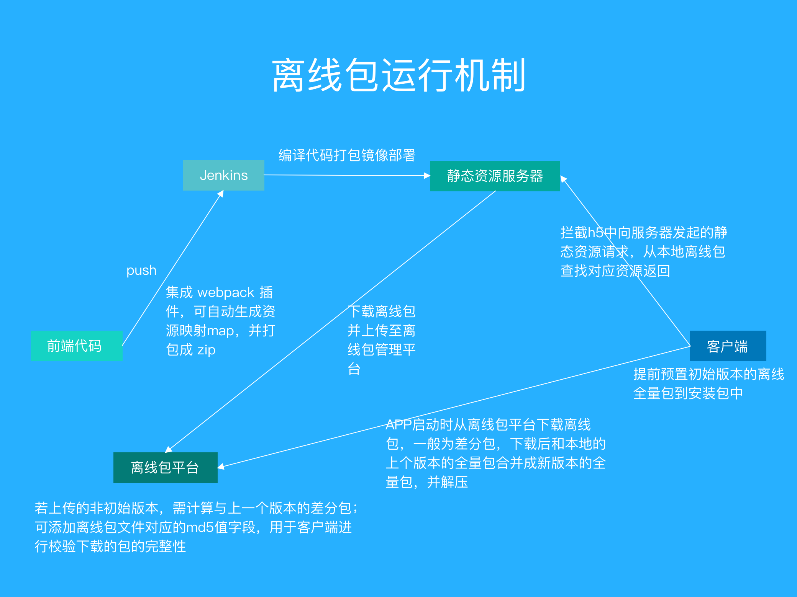
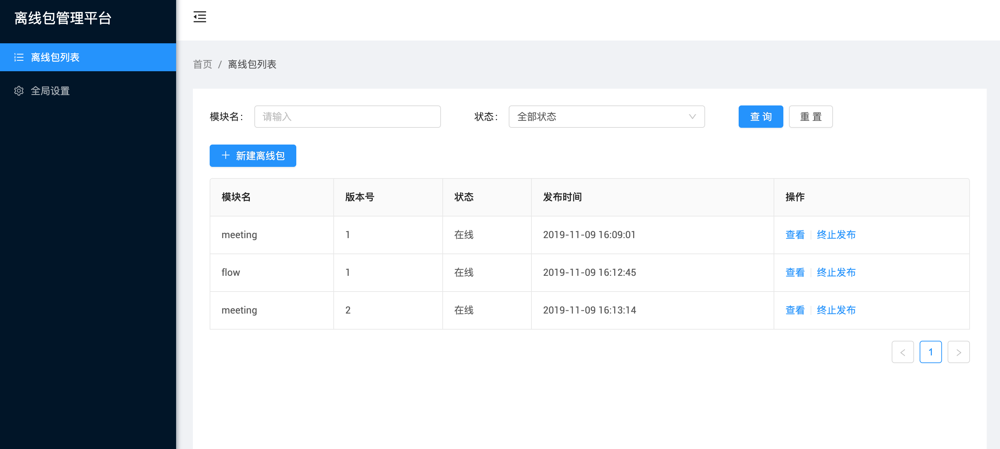

# offline-package-admin

离线包管理平台，用于管理前端资源离线包，提供离线包上传，以及提供客户端下载的离线包全量包（或差分包）以及最新版离线包的 json 文件

## 如何快速本地开发

#### 一、安装及部署本地 MySQL
提示：以下围绕 demo 的数据库相关配置进行，可自定，详见 ./server/.env.development 配置文件，其中数据库名：offline，用户名：root，密码：test1234

1、安装 MySQL

`
$ brew install mysql
`

2、安装完后启动 mysql

`
$ mysql.server start
`

3、执行安全设置，按照提示选择密码等级，并设置 root 密码

`
$ mysql_secure_installation
`

4、创建数据库，登录 mysql，按提示输入 root 密码

`
$ mysql -u root -p
`

5、登录后，创建数据库

`
create database offline character set utf8mb4;
`

6、然后，创建用户并授权

`
create user 'root'@'%' identified by 'test1234';
`

`
grant all privileges on offline.* to 'root'@'%';
`

`
flush privileges;
`

7、最后，查看当前的数据库，能看到 offline 说明正常

`
show databases;
`

说在最后，如果启动报错 "ER_NOT_SUPPORTED_AUTH_MODE"，那么解决方式是进入 mysql 执行

`
ALTER USER 'root'@'localhost' IDENTIFIED WITH mysql_native_password BY 'test1234';
`

#### 二、启动
1、启动后台服务，进入 ./server 目录执行
`
npm run start:dev
`

2、启动后台页面，进入 ./client 目录执行
`
npm run start
`

3、访问 http://localhost:5001/

## 原理

整体方案说明文章：

[Hybrid App 离线包方案实践](https://github.com/mcuking/blog/issues/63)

原理图如下图所示：

管理界面如下：

## 其它相关

前端（集成自动打包离线包插件，可在构建时自动打包）

[mobile-web-best-practice](https://github.com/mcuking/mobile-web-best-practice)

前端自动打包离线包插件

[offline-package-webpack-plugin](https://github.com/mcuking/offline-package-webpack-plugin)

客户端（集成离线包插件用于管理离线包资源以及拦截请求命中本地资源）

[mobile-web-best-practice-container](https://github.com/mcuking/mobile-web-best-practice-container)
